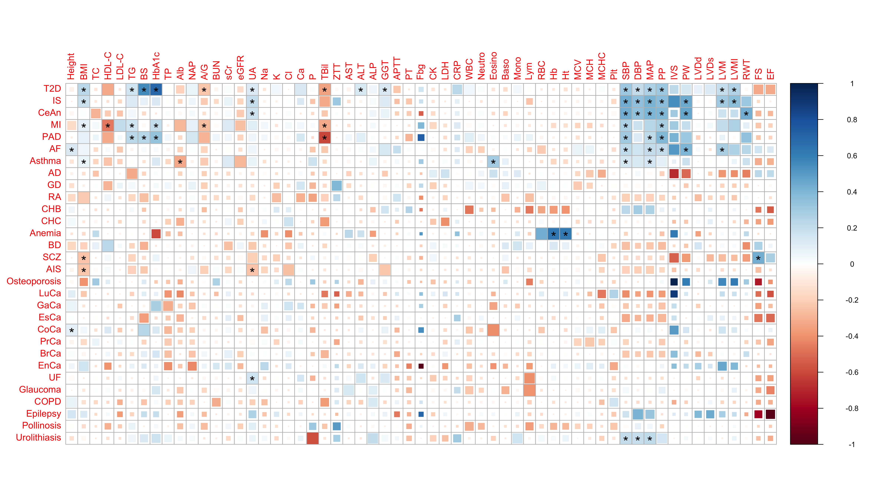

# corrplot of LDSC genetic correlation results

## Overview

This repo provides our script to reproduce genetic correlation [`corrplot`](https://github.com/taiyun/corrplot) (Fig. 2) based on bivariate LD score regression results ([Kanai, M. *et al*., *Nat. Genet.* 2018](http://dx.doi.org/10.1038/s41588-018-0047-6)).


## Requirements

* [R](https://www.r-project.org/) with [dplyr](https://github.com/tidyverse/dplyr) and our modified version of [corrplot](https://github.com/mkanai/corrplot) (mkanai/corrplot).

```{r}
install.packages("dplyr")
devtools::install_github("mkanai/corrplot")
```


## Genetic correlation plot (Fig. 2)
We modified [corrplot](https://github.com/taiyun/corrplot) to visualize pairwise genetic correlations estimated via [bivariate LD score regression](https://www.nature.com/articles/ng.3406). Larger squares correspond to more significant FDRs (`corrplot(method = 'psquare', p.mat = p.mat, ...)`). Significant correlations (FDR < 0.05) are indicated by asterisks (`corrplot(sig = 'pch', sig.level = 0.05, pch = '*')`).

<p align="center"></p>

### Usage
```{sh}
Rscript plot_corrplot_rg.R input_example/input_rg.txt input_example/traitlist.txt
```

### Input: Genetic correlations (`input_rg.txt`)

This file provides a list of all pairwise genetic correlations estimated via [ldsc](https://github.com/bulik/ldsc) software. The script expects all rows are unique (*i.e.,* one row per each pair of traits). The required fields are as follows:

* `p1_category`: Trait category of trait 1
* `p1`: Trait 1
* `p2_category`: Trait category of trait 2
* `p2`: Trait 2
* `rg`: Genetic correlation
* `p`: P-value
* `q`: FDR q-value


### Input: Trait list (`traitlist.txt`)

This file provides a list of traits and their categories. It defines a color of each category in a figure. The required fields are as follows:

* `CATEGORY`: Trait category
* `TRAIT`: Trait name
* `COLOR`: Category color


### Output
An example output is shown below. To get the published figure, we edited a pdf output using Adobe Illustrator.
<p align="center"></p>

## Citation
The original [`corrplot`](https://github.com/taiyun/corrplot) package:

* Taiyun Wei and Viliam Simko. R package "corrplot": Visualization of a Correlation Matrix (Version 0.85). (2018) Available from https://github.com/taiyun/corrplot.

The example data and published figure:

* Kanai, M., *et al*. Genetic analysis of quantitative traits in the Japanese population links cell types to complex human diseases. *Nat. Genet.* **50**, 390–400 (2018). [doi:10.1038/s41588-018-0047-6](http://dx.doi.org/10.1038/s41588-018-0047-6)

## Contact
Masahiro Kanai (mkanai@g.harvard.edu)

http://mkanai.github.io/

## Links
* [JENGER](http://jenger.riken.jp/en/) (the lab website)
* [The BioBank Japan Project](https://biobankjp.org/english/index.html)
* [RIKEN Center for Integrative Medical Sciences](http://www.ims.riken.jp/english/)
* [National Bioscience Database Center Human Database](https://humandbs.biosciencedbc.jp/en/)
* [corrplot](https://github.com/taiyun/corrplot)
* [ldsc](https://github.com/bulik/ldsc)
